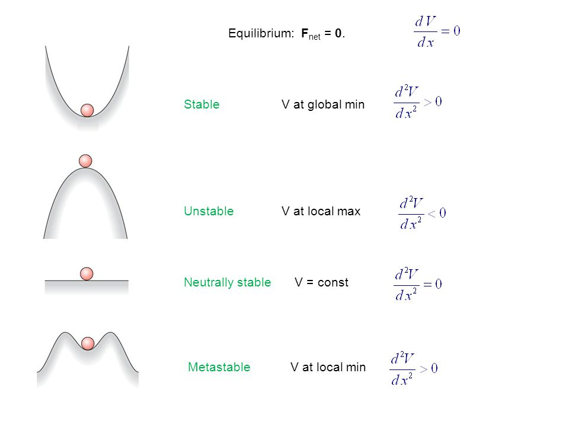
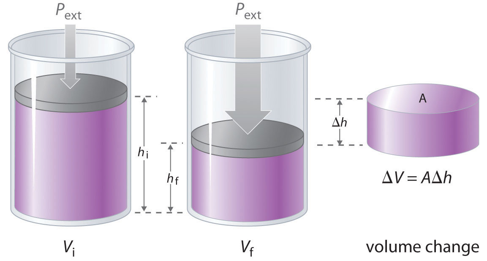
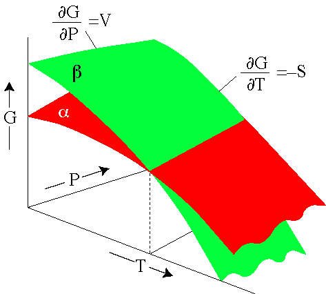

```{r setup, include=FALSE}
knitr::opts_chunk$set(echo = TRUE)
library(tidyverse)
library(latex2exp)
knitr::opts_knit$set(latex.options.xcolor="dvipsnames")
```

# Class notes
## Aug 27 2018
R$\rightleftharpoons$ P

$[\frac{^{34}S}{^{32}S}]_{reactant}/[\frac{^{34}S}{^{32}S}]_{product}=^{34}\alpha_{R,P}$ aka the fractionation factor

$^{34}\alpha_{R,P}=(^{34}\alpha^{EQ}_{R,P}- ^{34}\alpha^{Kin}_{R,P})\frac{\phi_{P,R}}{\phi_{R,P}}+ ^{34}\alpha^{Kin}_{R,P}$

Where $\frac{\phi_{P,R}}{\phi_{R,P}}$ represents the back reaction (numerator) divided by the forward reaction (denominator). It is also true that $\frac{\phi_{P,R}}{\phi_{R,P}}=e^{\frac{\Delta G_r}{RT}}$.

## Aug 29 2018
Thermodynamics terms:

### System:
  i) observer defined, separate from the rest of the universe (ROU)
  ii) nature of the boundary between the system and the ROU defines the system type
    a. open: mass and energy can cross the boundary. Example: hydrothermal ore system
    b. closed: energy may cross but not mass
    c. adiabatic: no heat energy may cross. Example: developing clouds or ascending magma
    d. isolated: neither heat nor mass may cross
    
Can think of a system as a collection of phases (see below)

### Phase:
substance with uniform chemical and physical properties or properties that smoothly vary

  i) minerals: each type is a potential phase
  ii) liquids: silicate melts, aqueous solutions, glasses
  iii) gases:
  iv) fluids: gas/liquid above a "critical" point
  
most phases we encounter are solutions with varying chemical compositions, not pure solutions.

example: plagioclase feldspar: imagine that the green in the image is anorithite (Ca-rich feldspar) and the red is albite (Na-rich feldspar)


### Components
chemical formula used to describe the composition of a phase

example: alkaline feldspar (f$_{sp}$)

Composition: Na$_{0.5}$K$_{0.5}$AlSi$_3$O$_8$

Components: can use different units, below are three versions of the same information, typically we choose the option with the smallest number of components (aka the last option here)

|Element|Atom \%|
|:------|:------|
|  Na   | 3.85  |
|   K   | 3.85  |
|  Al   | 7.70  |
|  Si   | 23.08 |
|   O   | 61.54 |

|Oxides|Mol \%|
|:-----|:-----|
|\ch{K2O}| 6.25 |
|\ch{Na2O}| 6.25|
|\ch{Al2O2}|12.50|
|\ch{SiO2}|75.00|

|f$_{sp}$ molecules|mol \%|
|:---------------|:-----|
|\ch{KAlSi3O8}  |50    |
|\ch{NaAlSi3O8} |50    |

\textit{Aside:} Why do we care about feldspar? It makes white rocks white (with quartz), but Peter says green rocks are the most important

### Variables
refers to the chemical or physical characteristics of a phase or system

examples: temperature (T), pressure (P), composition, density ($\rho$), chemical potential ($\mu$), fugacity, activity

variables come in two flavors:
1. intensive: independent of the amount of material present
  i) examples: T, P, $\mu$
2. extensive: dependent on the amount of material present
  i) examples: mass, volume, total heat capacity
  ii) typically 1st order dependencies
  
The ratio of two extensive variables is an intensive variable because the 1st order dependencies cancel. Example: $\rho=m/v$

### State
Ensemble of values for all relevant variables describing a phase or a system

relevant variables = state variables

Equation of State is the explicit representation of the mathematical relationship between the variables of a particular phase or system

Example: ideal gas law $PV=nRT$

### Equilibrium
a system is at equilibrium if all the variables that describe its state do not change with time (scale depends on the question)

Types of equilibrium (essentially defined by its response to a small pertubation):
1. stable equilibrium: returns to initial state after small pertubation
2. unstable equilibrium: does not return to initial state after small pertubation (not very relevant to real world)
3. metastable equilibrium: returns to initial state after a sufficiently small pertubation
4. conditional equilibrium (neutrally stable): doesn't care about pertubations (not very relevant to real world)



First order derivative for all of these states is the same (0)

## Aug 31 2018:
Thermodynamics doesn't care how you get there, just where you start and where you end

### Thermodynamics thought experiment: Flagstaff to Benson
What is the system: you! on top of Flagstaff Mountain (elevation 7000 ft)

There is a lot of wind, so T is constant

And we are carrying around bananas to replenish our energy, so don't worry about that

Pick a path from Flagstaff Mountain to Benson Earth Sciences Building and figure out the change in energy!

We care about potential energy in this scenario: $E_p\sim\rho gh$

Density ($\rho$) is constant (we aren't gaining/losing weight) and gravity ($g$) is constant as far as we care. So the change in energy is dependent on the change in elevation ($h$): $\Delta E_p=\Delta h=h_{Benson}-h_{Flagstaff}=5366-7000=-1634ft$

It doesn't matter if you go other places on the way from Flagstaff to Benson, or if you have to cross a ridge to get down to Benson, all of these intermediate stops will cancel out.

This is a state function.

### State functions
State functions only depend on the initial and final state (1st characterization of state function)

$\int_{z_0}^{z_1}dz=z_1-z_0$ (2nd characterization of state function)

We are taking the definite integral $\int^{z_1}_{z_0}$ of a total or exact differential $dz$

The definition of a total or exact differential is that when you integrate it the answer is path independent

Path independence: doesn't matter how you get from initial state to final state

State functions are cyclic, if you go from A to B and then B to A there is no net change: $\int^{z_1}_{z_0}dz+\int^{z_0}_{z_1}dz=0$

State function: $z(x,y)$ so what's the differential? $dz=f(dx,dy)=(\frac{\partial z}{\partial x})_ydx+(\frac{\partial z}{\partial y})_xdy$ where $(\frac{\partial z}{\partial x})_y$ is the partial differential, meaning that you are looking at the change in $z$ given a change in $x$ while holding $y$ constant.

#### Example: Ideal gas law
$PV=nRT$ ideal gas law aka the equation of state you didn't know you knew

Let's find the equation for the volume and final the total differential: $V=\frac{nRT}{P}$

Volume is an extensive variable (it depends on the amount of stuff, if you add more stuff you add more volume) so we have 3 variables in this function: $n$, $T$, and $P$ and $R$ is always a constant (by definition)

Using our simplied differential function above: $dV=(\frac{\partial V}{\partial n})_{T,P}dn+(\frac{\partial V}{\partial T})_{n,P}dT+(\frac{\partial V}{\partial P})_{n,T}dP$

Let's break it down a little more: if we take the partial differential of the volume with respect to the number of moles holding temperature and pressure constant (first term from above), we can replace the partial of volume with our definition of volume, $V=\frac{nRT}{P}$, and then remove the constants from the partial of this equation. This leaves us with the partial differential of the number of moles, divided by the partial differential of the number of moles, which is 1. Thus the partial differential of volume with respect to the number of moles holding temperature and pressure constant is simply equal to $\frac{RT}{P}$

$(\frac{\partial V}{\partial n})_{T,P}=(\frac{\partial[\frac{nRT}{P}]}{\partial n})_{T,P}=\frac{RT}{P}(\frac{\partial n}{\partial n})=\frac{RT}{P}$

Let's repeat for the other two (without the long version):

$(\frac{\partial V}{\partial T})_{n,P}=(\frac{\partial[\frac{nRT}{P}]}{\partial T})_{n,P}=\frac{nR}{P}(\frac{\partial T}{\partial T})=\frac{nR}{P}$

And the tricky one:

$(\frac{\partial V}{\partial P})_{n,T}=(\frac{\partial[\frac{nRT}{P}]}{\partial P})_{n,T}=nRT(\frac{\partial \frac{1}{P}}{\partial P})=nRT(-P^{-2})$

Remembering differential rule: $\frac{\partial x^n}{\partial x}=nx^{n-1}$

The definition of volume we've been using, $V=\frac{nRT}{P}$ is extensive. If we increase $n$ by $k$, $T$ by $k$ and $P$ by $k$ we get: $V_k=\frac{knRkT}{kP}=\frac{k^2}{k}\frac{nRT}{P}=k\frac{nRT}{P}=kV_0$

If we define $\bar{V}=\frac{V}{n}=\frac{RT}{P}$ then we have an intensive variable (the ratio of two extensive variables is an intensive variable), so now if we increase all of the variables ($T$ and $P$) by $k$ we get: $\bar{V}_k=\frac{RkT}{kP}=\frac{k}{k}\frac{RT}{P}=\frac{RT}{P}$

This leads to the second test for exactness: the differential should be commutative (the order of differentiation shouldn't matter)

$\frac{\partial(\frac{\partial\bar{V}}{\partial T})}{\partial P}=\frac{\partial(\frac{\partial\bar{V}}{\partial P})}{\partial T}$

And now we get the fourth characterization of state functions.

If any of the characterizations of a state function is true, all of them are true, so you only need to prove it once.

## Sep 5 2018
We are going to take the concepts and properties and start to develop laws of thermodynamics, with the intention of getting to the point where we can isolate the effects of chemical work on a system.

Mathematical criterion for equilibrium using a mechanical analogy: Gravitational potential energy (GPE)


Again the slope for all of these cases is 0. The definition of equilibrium is $\frac{dh}{dx}=0$ at equilibrium.

$GPE\sim\rho g h$ so $\frac{d(GPE)}{dx}=\frac{d(\rho gh)}{dx}$ but $\rho g$ is constant so $\frac{d(\rho gh)}{dx}=\rho g\frac{dh}{dx}=0$ at equilibrium. So $d(GPE)=0$

Thermodynamics is based on a single assumption that can be expressed several ways:

1. energy can neither be created nor destroyed
2. all forms of energy are interconvertible
3. each definite state of a definite system is characterized by a definite energy
4. can't get something for nothing

Gibbs' contribution was taking this and converting into a mathematical statement

relationships implied by these statements, to illustrate let's say: let there be a property of a system called the internal energy ($U$). Let $U$ of the system under consideration be a function of the state variables ($x,y,z,...$) such that $U(x,y,z,...)$

1. $U(x,y,z,...)$ is fully characterized by the state of the system. This means if we can know $x,y,z,...$ we can then know $U$
2. $U_{system}=\Sigma U_{parts}$
3. $\int^{U_2}_{U_1}dU=U_2-U_1$
4. $\int^{U_2}_{U_1}dU + \int^{U_1}_{U_2}=0$
5. $\int^{U_2}_{U_1}$ is path independent

Violation of any of these implies perpetual motion.

The essential contribution of Gibbs to thermodynamics: $U(x,y,z,...)$ has an exact differential.

Now let's take advantage of this:

$dU=(\frac{\partial U}{\partial x})_{y,z,...}dx+(\frac{\partial U}{\partial y})_{x,z,...}dy+(\frac{\partial U}{\partial z})_{x,y,...}dz+(\frac{\partial U}{\partial ...})_{x,y,z}d...$

In the lingo: a function with this property is known as a state function

How do we change internal energy? We add or subtract something.

|Energy|Cognate intensive thermo variable|
|:-----|:--------------------------------|
|Heat (Q)| Temperature (T)|
|PV (mechanical work)|Pressure (P)|
|Electrical work|Electrical potential|
|Gravitational work|Gravitational potential|
|Chemical work (object of our affection)|Chemical potential ($\mu$)|

Think of the cognate variables as the thing that lets you investigate the directionality of the change in energy.

Chemical work has two types:

1. change in composition of a phase: exchanging between garnet and biotite (exchange reaction)
2. change in abundance of a phase: exchanging between liquid water and water vapor (net transfer reaction)

Consider a system in which chemical work is impossible. The system is fixed in composition (pure substance). System has one phase only that is fixed in abundance or amount.

In this system we allow PV work and heat only.

$U$ can be changed by adding or extracting heat, by performing PV work, or by allowing system to perform PV work on its surroundings.

$dU=\delta Q+\delta W$

We can't know a priori how to integrate $\delta Q$ or $\delta W$. a priori don't know if these are exact differentials.

Need to transform these into integrateable forms (alternatively we need to transform energetic changes into a form that relies on easily measured variables).

## Sep 7 2018
Thought experiment: assume that the system is at the same temperature for all time. $dl$ here is small enough that the pressure remains constant. We can move the piston by $dl$ by applying a force to the piston.



$\delta W=-P*A*dl$ where $A*dl=dV$ so $\delta W=-PdV$ which we can rearrange to $\frac{\delta W}{P}=d(-V)$ normalizing by $P$ makes this into an exact differential that we can integrate.

Scientific thermodynamic convention: $\delta W$ has a positive value when work is done on a (actually to) the system. $P$ always takes on a positive value, work done on the system decreases volume and our sign convention accounts for this.

Process: the act of adding or extracting energy from its system

Reversible: (cylinder thought experiment) if the process is stopped at any time, the state of the system does not change. Reversible processes are series of equilibrium states

Irreversible: when the process is stopped, further changes to the state of the system occur.

|Reversible|Irreversible|
|<---------|<-----------|
|idealization|reality|
|well developed coherent theory|complicated and splintered theory|
|theory applicable b/c relevant lab data exists|lab data doesn't yet exist|
|good for geologic time. rocks tend to act like a state| |

$\frac{\delta W}{P}=d(-V)$ is only for a reversible process

In general, the work done on a system will be greater than in our thought experiment. (throw a big rock onto a piston vs tiny particles). $\therefore \delta W \geq -PdV$

During a reversible process:

$\frac{\delta[energy]}{cognate intensive variable}=d(new variable)$

Now we can consider heat: $\frac{\delta Q}{T}=dS$ where $T$ is the potential that monitors heat flow and $S$ is the thermal displacement.

Forget about the definition of entropy right now, none of this disorder shit. Entropy isn't that special. Just a variable.

$\frac{\delta Q}{T}\leq dS$ For a reversible process, it's equal. In reality, its an inequality. Entropy is always greater than the heat.

2nd law of thermodynamics

$dU=TdS-PdV$ now measureable (for a pure substance)

## Sep 10 2018
Pursue the definition at equilibrium, specifically the definition of $U$. Start releasing restraints.

$d=\delta Q+\delta W=TdS-PdV=0$ when you do thermal work you add or subtract heat at constant temperature.

$U$ is a function of $S$ and $V$ for a fixed amount of substance: $U(S,V)$

New definition for $T$ and $P$:

$T=(\frac{\partial U}{\partial S})_{n,P,V}ds$ intensive

$-P=(\frac{\partial U}{\partial V})_{S,n,T}dV$ intensive 

Expand this to allow for possibility of chemical work: ie phase composition might change or abundances of phases in your system might change

1. Define a phase or system (collection of phases) descrbied by $c$ components ($c=$ number of components -> $1,2,3,...,c$)
2. each component will be present in an amount $n_1,n_2,n_3,...,n_c$

This releases the pure substance restraints

$U$ is now: $U(S,V,n_1,n_2,n_3,...,n_c)$

$dU=(\frac{\partial U}{\partial S})_{V,n}dS+(\frac{\partial U}{\partial V})_{S,n}dV+(\frac{\partial U}{\partial n_1})_{S,V,n\neq n_1}dn_1+...$

Define a new intensive variable of chemical potential of component: $\mu_i=(\frac{\partial U}{\partial n_i})_{S,V,n\neq n_i}$

$dU=Tds-PdV+\mu_1dn_1+\mu_2dn_2+\mu_3dn_3+...+\mu_cdn_c=TdS-PdV+\displaystyle\sum^c_{i=1}\mu_idn_i$

Euler's theorem tells us for homogeneous function of degree 1 (if you double stuff and you double other variables then you double internal energy)

$U(S,V,n_i)=TS-PV+\displaystyle\sum^c_{i=1}\mu_in_i$

for 1 component (pure substance) varies in abundance not composition: $U=TS-PV+\displaystyle\sum\mu_in_i$

Divide by $n_i$: $\frac{U}{n_i}=\frac{TS}{n_i}-\frac{PV}{n_i}+\frac{\mu_in_i}{n_i}$

$\bar{U}=T\bar{S}-P\bar{V}+\mu_i$

$\mu_i=\bar{U}-T\bar{S}+P\bar{V}$

$\bar{U}$ is the internal energy per mole of component 1

Solution phase of multicomponent system: divide by $\displaystyle\sum^c_{i=1}n_i$

$\bar{U}=T\bar{S}-P\bar{V}+\displaystyle\sum^c_{i=1}\mu_ix_i$

$X_i$ is the mole fraction of component i aka the moles of component i divided by the total number of moles in the system

examples:

Plagioclase crystal:

Component 1: \ch{NaAlSi3O8} (Ab)

Component 2: \ch{CaAl2Si2O8} (An)

$X_{ab}=\frac{n_{ab}}{n_{plagioclase}}=\frac{n_{ab}}{n_{ab}+n_{an}}$

consider a solution phase $j$ (way of indicating which phase you are talking about)

$\bar{U}_j=T\bar{S}_j-P\bar{V}_j+\Sigma^c_{i=1}\mu_{i,j}X_i$ (Component i may be present in multiple phases)

example: $\mu_{H_20}$ the numerical value will be different for steam versus ice

$\mu_{SiO_2}$ numberic value will be different for $\alpha$-quartz, $\beta$-quartz, stishovite, tridymite

$\mu_{Al_2SiO_5}$ different for andallusite, byomite, sillimanite

$\mu_{i,j}$ where $i$ is the component and $j$ is the phase

ex: $\mu^{P,T}_{i,j}$ as $\mu^{3kbar,500C}_{Al_2SiO_5,kyamite}$

## Sep 12 2018
Homogeneous equilibrium: refers to processes internal to a phase ($\Delta T,\Delta P, \Delta n_i$)

known volume of a single phase

example: plagioclase feldspar: here we refer to the state of the internal distribution of components within a phase

Internal distribution is time invariant:

$\bar{U}_j=T\bar{S}_j-P\bar{V}_j+\displaystyle\sum^c_{i=1}\mu_{i,j}X_j$ molar internal energy

1. take the total differential (use the product rule)

$d\bar{U}_j=Td\bar{S}_j+\bar{S}_jdT-Pd\bar{V}_j-\bar{V}_jdP+\displaystyle\sum^c_{i=1}\mu_{i,j}dX_j+\displaystyle\sum^c_{i=1}X_jd\mu_{i,j}=0$ at equilibrium

2. compare to alternate form of $d\bar{U_j}$

$d\bar{U}_j=Td\bar{S}_j-Pd\bar{V}_j+\displaystyle\sum^c_{i=1}\mu_{i,j}dX_j=0$ at equilibrium

3. at equilibrium these expressions are the same, so we can set them equal and eliminate common terms

$\bar{S}_jdT-\bar{V}_jdP+\displaystyle\sum^c_{i=1}X_jd\mu_{i,j}=0$

now we can multiply by the total amount of material in the system to get the extensive version:

$S_jdT-V_jdP++\displaystyle\sum^c_{i=1}n_id\mu_{i,j}=0$

This allows us to define the Gibbs-Duhem equation which applies under conditions of homogeneous equilibrium (that is that it refers to a single phase ignoring for the time what else might be present)

What good is it? shows how at equilibrium cation ordering (chemical zoning) in a crystal responds to $dP,dT$. We can use this ot back out the changes in $T$ and $P$ experienced by a crystal using the final cation ordering in a crystal. It allows for the construction of phase diagrams without any knowledge of thermodynamics.

Its most famous application is in the derivation of the phase rule:

Consider a system of $p$ phases and $c$ components. The number of variables (degrees of freedom,$f$) that define this system will be $c+2$ in number. $f=c+2-p$

example: metamorphosed bauxite with \ch{Al2O3} and \ch{SiO2} in 1:1 molar proportions (\ch{Al2SiO5}). You can find this in NM and NH in three different minerals: kyanite, andalucite and sillimanite

$c=1$, $p=3$ so $f=1+2-3=0$

This tells us that temperature and pressure can't be changed independently. Don't apply this willynilly.

Let's get away from homogeneous equilibrium and into

Heterogeneous equilibrium: definted by relations among variables in a system with 2 or more phases at equilibrium.

Consider a 2 phase system:
- phases are pure substances defined by the same composition and described by one component
- the outer boundary is rigid, impermeable and insulating

Each phase ($\alpha$ and $\beta$ have variables $V,n,S,P,T,\mu$ specific to the phase)

Because the boundary is rigid, we can say: $V_{system}=V_\alpha+V_\beta=constant$ so $dV_{system}=0=dV_\alpha+dV_\beta$ so $dV_\alpha=-dV_\beta$

Because the boundary is impermeable, we can say: $n_{system}=n_\alpha+n_\beta=constant$ so $dn_\alpha=-dn_\beta$

Because the boundary is insulating we can say: $dQ_{system}=0$ so $dS_{system}=\frac{dQ_{system}}{T}=0$ at equilibrium and $S_{system}=S_\alpha+S_\beta$ so $dS_\alpha=-dS_\beta$

Because the system is at equilibrium $U_{system}$ is at a local minimum so $dU_{system}=0$

next we will apply these constraints to come up with 3 conditions of heterogeneous equilibrium.

##Sep 19 2018
### Case 1
Inner boundary is rigid, impermeable but conducting (allows for heat transfer)

so: $dV_\alpha=0=-dV_\beta$, $dn_\alpha=0=-dn_\beta$.

Equilibrium must be maintained with respect to an incremental amount of heat transfer between phases (a reversible process):

$dU_\alpha=T_\alpha dS_\alpha$ and $dU_\beta=T_\beta dS_\beta$

$dU_{system}=T_\alpha dS_\alpha+T_\beta dS_\beta=0$

$dS_\alpha=-dS_\beta$ from our insulating external boundary

This implies that at equilibrium $(T_\alpha-T_\beta)dS_\alpha=0$

By definition: $dS_\alpha=\frac{dQ_\alpha}{T_\alpha}$ and $\frac{dQ_\alpha}{T_\alpha}$ is not zero

So if we substitute in above $(T_\alpha-T_\beta)dS_\alpha=(T_\alpha-T_\beta)\frac{dQ_\alpha}{T_\alpha}=0$ requires that $(T_\alpha-T_\beta)=0$ which means that $T_\alpha=T_\beta$

### Case 2
Inner boundary is impermeable, flexible and conducting (allows for heat transfer and PV work)

So $dn_\alpha=0=-dn_\beta$

Equilibrium must be maintained with respect to the transfer of an incremental amount of heat between phases and incremental changes in phase volues.

At equilibrium $dU_{system}=(T_\alpha dS_\alpha-P_\alpha dV_\alpha)+(T_\beta dS_\beta-P_\beta dS_\beta)=0$

And as before $dS_\alpha=-dS_\beta$ and $dV_\alpha=-dV_\beta$ so: $dU_{system}=(T_\alpha-T_\beta)dS_\alpha-(P_\alpha-P_\beta)dV_\alpha=0$

We know from Case #1 that $T_\alpha=T_\beta$ which makes the whole first term equal to zero, so now the second term must also equal zero which means that $P_\alpha=P_\beta$

### Case 3
Inner boundary is permeable, flexible and conducting (allows for heat transfer, mechanical work and chemical work)

$dU_{system}=dU_\alpha+dU_\beta=0=(T_\alpha dS_\alpha-P_\alpha dV_\alpha+\mu_{1,\alpha}dn_\alpha)+(T_\beta dS_\beta-P_\beta dV_\beta+\mu_{1,\beta})$ (remember that $\mu_{1,\alpha}$ means the chemical potential of component 1 in phase $\alpha$, here the inclusion of the component is redundant, but it's good practice)

From our external boundary we know: $dS_\alpha=-dS_\beta$, $dV_\alpha=-dV_\beta$ and $dn_\alpha=-dn_\beta$

So $dU_{system}=(T_\alpha-T_\beta)dS_\alpha-(P_\alpha-P_\beta)dV_\alpha+(\mu_{1,\alpha}-\mu_{1,\beta})dn_\alpha=0$. From above we know that $T_\alpha=T_\beta$ and $P_\alpha=P_\beta$ so the final term must also equal zero and thus $\mu_{1,\alpha}=\mu_{1,\beta}$

### Conditions of heterogeneous equilibrium
1. $T_\alpha=T_\beta$
2. $P_\alpha=P_\beta$
3. $\mu_{1,\alpha}=\mu_{1,\beta}$ (this is a special case, but we'll look at the more general)

### 2 Feldspar Thermometer Example
The thermometer uses the composition of coexisting plagioclase and alkali feldspar to tell the temperature at which they were last at equilibrium.

So we have:
|Phase I|Phase II|
|<------|<-------|
|Plagioclase|Alkali|
|ab \ch{NaAlSi3O8}|ab \ch{NaAlSi3O8}|
|an \ch{CaAl2Si2O8}|or \ch{KAlSi3O8}|

The two phases share a component: ab

At equilibrium $\mu_{ab,I}=\mu_{ab,II}$

Chemical potentials can be represented as functions of temperature, pressure and mole fractions so we can look at $f(T,P,X_{ab,I},X_{ab,II})=0$ but we know that $X_{ab,I}$ and $X_{ab,II}$ are fixed, so the function is just of temperature and pressure $f(T,P)=0$

```{r, echo=FALSE}
df<-data.frame(x=c(5:20),y=c(seq(0,45,by=3)))
ggplot(df,aes(x=x,y=y))+geom_line()+labs(x="Temperature",y="Pressure")
```

The line represents the relationship between temperature and pressure at equilibrium for feldspars of fixed composition.

Take home: going from $\mu_\alpha-\mu_\beta=0$ to the specific function is complicated, but we can always come back to $\mu_\alpha-\mu_\beta=0$

## Sep 24 2018
Working towards a generalized 3rd condition of heterogeneous equilibrium

Generally: have a system with phases: $j$ in number, pure substances; phase components $i$ in number and system components $k$ in number. The system's external boundary is rigid, insulating and impermeable so: $dV_{system}=\displaystyle\sum_jdV_j=0$, $dS_{system}=\displaystyle\sum_jdS_j=0$, $dn_k=0$ for all $k$

We can make 3 general statements

### 1: there exists a stoichiometric reaction relationship among the phase components $i$
$\displaystyle\sum_i\nu_i(i)=0$ where $\nu_i$ represents the stoichiometric coefficients (positive for products, negative for reactants)

### 2: We can write the total number of moles of each system component $k$ in terms of the number of moles of each phase component $i$
$n_k=\displaystyle\sum_i\epsilon_{k,i}n_i=constant$ where $\epsilon_{k,i}$ is the moles of system component $k$ in one mole of phase component $i$

As a result: $dn_k=\displaystyle\sum_i\epsilon_{k,i}dn_i=0$

### 3: We can arbitrarily pick one phase component (1) and express the $dn_i$ in terms of $dn_1$

### Specific example: rock!
|Phases ($j$)|Phase components ($i$)|abbreviation|System components ($k$)|
|:-----------|:---------------------|:-----------|:----------------------|
|anorthite|\ch{CaAl2Si2O8}|an|\ch{CaO}|
|grossular|\ch{Ca3Al2Si3O12}|gr|\ch{SiO2}|
|kyanite|\ch{Al2SiO5}|ky|\ch{Al2O3}|
|quartz|\ch{SiO2}|qz||

System boundary: rigid, insulating, and no loss/gain of system components across the boundary

Definitions reminders:

Phase component: typically the most efficient way to describe the composition of each phase ($C_p$)

System component: most efficient way to describe the composition of the whole system ($C_s$). Typically oxides except in redox conditions

In general: $C_s\leq C_p$ which implies a linear relationship relating the components

Repeating the statements from above with this specific case:
### 1: Stoichiometric reaction relationship
3\ch{CaAl2Si2O8}-\ch{Ca3Al2Si3O12}-2\ch{Al2SiO5}-\ch{SiO2}$=0=3an-gr-2ky-qz$

So $\nu_{an}=3$, $\nu_{gr}=-1$, $\nu_{ky}=-2$ and $\nu_{qz}=-1$

This is the most compact and complete way of describing mass transfer among phase components and accordingly relations among $\mu_{i,j}$ at equilibrium

The stoichiometric relationship between phase components, NOT phases. Phases aren't always pure, but we will still be able to develop the stoichiometric relationship of the phase components.

The choice of anorthite as the product was arbitrary here, could have been any of them.

### 2: Chemistry of the system is related to chemistry of the phase components
$n_{CaO}=3n_{gr}+1n_{an}+0n_{ky}+0n_{qz}$ so $\epsilon_{CaO,gr}=3$, $\epsilon_{CaO,an}=1$ and $\epsilon_{CaO,ky}=\epsilon_{CaO,qz}=0$

$n_{Al_2O_3}=1n_{gr}+1n_{an}+1n_{ky}+0n_{qz}$ so $\epsilon_{Al_2O_3,gr}=\epsilon_{Al_2O_3,an}=\epsilon_{Al_2O_3,ky}=1$ and $\epsilon_{Al_2O_3,qz}=0$

$n_{SiO_2}=3n_{gr}+2n_{an}+1n_{ky}+1n_{qz}$ so $\epsilon_{SiO_2,gr}=3$, $\epsilon_{SiO_2,an}=2$ and $\epsilon_{SiO_2,ky}=\epsilon_{SiO_2,qz}=1$

We know that $dn_k=\displaystyle\sum_i\epsilon_{k,i}dn_i=0$ so:

$dn_{CaO}=3dn_{gr}+1dn_{an}=0$

$dn_{Al_2O_3}=1dn_{gr}+1dn_{an}+1dn_{ky}=0$

$dn_{SiO_2}=3dn_{gr}+2dn_{an}+1dn_{ky}+1dn_{qz}=0$

### 3: let $gr$ be phase component 1
[\ch{CaO}] $dn_{an}=-3dn_{gr}$ which can then be substituted into:

[\ch{Al2O3}] $dn_{gr}-3dn_{gr}+dn_{ky}=0$ so $dn_{ky}=2dn_{gr}$ which we can substitute into:

[\ch{SiO2}] $3dn_{gr}-6dn_{gr}+2dn_{gr}+dn_{qz}=0$ so $dn_{qz}=dn_{gr}$

### The quick way
i. pick a reference $C_p$
ii. $dn_i=f(dn_1)$ after solving $dn_k=\displaystyle\sum_i\epsilon_{k,i}dn_i$ which generally is of the form: $dn_i=\frac{\nu_i^\alpha}{\nu_1^\alpha}dn_1$

This describes the coupling between each change in the number of mole of your $C_p$ given the stoichiometric reaction relationship ($\alpha$) among phase components $i$

Here we have a stoichiometric reaction relationship: $3an-gr-2ky-qz=0$

We set phase component 1 as $gr$ so we get:

$dn_{an}=\frac{+3}{-1}dn_{gr}=-3dn_{gr}$

$dn_{ky}=\frac{-2}{-1}dn_{gr}=2dn_{gr}$

$dn_{qz}=\frac{-1}{-1}dn_{gr}=1dn_{gr}$

$dn_{gr}=\frac{-1}{-1}dn_{gr}=1dn_{gr}$

This allows us to simplify our expression for the internal energy of the entire system.

As a slightly generalized example:

$dU_{system}=\displaystyle\sum_jdU_j=0$ at equilibrium

$dU_j=T_jdS_j-P_jdV_j+\mu_{i,j}dn_i$

$dU_{system}=\displaystyle\sum_jT_jdS_j-\displaystyle\sum_jP_jdV_j+\displaystyle\sum_j\mu_{i,j}dn_i=0$

Because of the first and second conditions of heterogeneous equilibrium, we know that $T$ and $P$ are constant throughout the system so:

$dU_{system}=T\displaystyle\sum_jdS_j-P\displaystyle\sum_jdV_j+\displaystyle\sum_j\mu_{i,j}dn_i=0$ where we know that $\displaystyle\sum_jdS_j=0$ and $\displaystyle\sum_jdV_j=0$ so $\displaystyle\sum_j\mu_{i,j}dn_i=0$ and this is where we will apply the stoichiometric reaction relationship.

## Sep 26 2018
Finish deriving the 3rd condition of heterogeneous equilibrium, finally starting to calculate real(ish) things.

4 phases (an, gr, qz, ky) represented as $j$

4 phase components, pure substances, represented as $i$

$\displaystyle\sum_j\mu_{i,j}dn_i=0$ can be rewritten as $\displaystyle\sum_i\mu_{i,j}\frac{\nu_i}{\nu_1}dn_1=0$

If we multiply this by $\nu_1$ and $\frac{1}{dn_1}$ we get: $\displaystyle\sum_i\mu_{i,j}\nu_i=0$ at equilibrium which is the third condition of heterogeneous equilibrium

For every stoichiometric reaction relationship that can be written among the phase components in a system, there exists, at equilibrium, a corresponding relationship among their chemical potentials

$3\mu_{CaAl_2Si_2O_8,an}-1\mu_{Ca3Al_2Si_3O_{12},gr}-2\mu_{Al_2SiO_5,ky}-1\mu_{SiO_2,qz}=0$

For every molar unit change in one, the rest must change proportionally.

$3f_{an}(P,T)-1f_{gr}(P,T)-2f_{ky}(P,T)-1f_{qz}(P,T)=0$

$f(P,T)=0$ at equilibrium

### Energy functions:

$U_j=TS_j-PV_j+\displaystyle\sum_i\mu_{i,j}n_i$

$U_{system}=TS_{system}-PV_{system}+\displaystyle\sum_k\mu_{k,system}n_k$

$dU=TdS-PdV+\displaystyle\sum_i\mu_{i,j}dn_i$

#### Enthalpy:

$U+PV\equiv H$

$dH=dU+PdV+VdP$

$dH=TdS+VdP+\displaystyle\sum_i\mu_{i,j}dn_i=0$

Boundary is insulating but flexible

#### Helmholtz free energy:

$U-TS\equiv A$

$dA=dU-TdS-SdT$

$dA=-SdT-PdV+\displaystyle\sum_i\mu_{i,j}dn_i=0$

Rigid and conducting boundary

#### Gibbs free energy:
$U+PV-TS\equiv G$

$dG=dU+PdV+VdP-TdS-SdT$

$dG=-SdT+VdP+\displaystyle\sum_i\mu_{i,j}dn_i=0$

Flexible and conducting boundary

$U_j=TS_j-PV_j+\displaystyle\sum_i\mu_{i,j}n_i$

$G_j=U_j+PV_j-TS_j$

$G_j=\displaystyle\sum_i\mu_{i,j}n_i$

If we then divide by $\displaystyle\sum_in_i$ we get the gibbs free energy on a per mole basis: $\bar{G_j}=\displaystyle\sum_i\mu_{i,j}X_i$ where as before $X_i$ is the mole fraction

For a pure substantce: $\bar{G_j}=\mu_{1,j}$ because $X_i=1$

## September 28 2018
Energy functions:

- $U$: internal energy
- $H\equiv U+PV$: enthalpy
- $A\equiv U-TS$: Helmholtz free energy
- $G\equiv U+PV-TS$: Gibbs free energy

The Gibbs free energy isolates the energetic changes due to the addition/subtraction of mass from the system aka it isolates the chemical work

Another way to think about these is to consider the system boundaries (assuming for the time being that the number of moles of the system components is constant)

|Energy function|Function of|System boundaries|
|:--------------|:----------|:----------------|
|$U$|$f(S,V)$|insulating, rigid|
|$H$|$f(S,P)$|insulating, flexible|
|$A$|$f(T,V)$|conducting, rigid|
|$G$|$f(T,P)$|conducting, flexible|

Gibbs free energy is generally a geologist's favority energy function because it is a function of temperature and pressure

But enthalpy is useful for magma ascent (because it is adiabatic) and Helmholtz free energy is great for experiments because we can fix the volume and measure the pressure.

Focusing on Gibbs again

$U_j=TS_j-PV_j+\displaystyle\sum_i\mu_{i,j}n_i$

$G\equiv U-TS+PV$

$G_j=\displaystyle\sum_i\mu_{i,j}n_i$ this is extensive

If we divide by $\displaystyle\sum_in_i$ we can make it intensive!

$\bar{G_j}=\displaystyle\sum_i\mu_{i,j}X_i$ where $X_i$ is the mole fraction defined as $X_i=\frac{n_i}{\displaystyle\sum_in_i}$. Now we have the gibbs free energy on a per mole basis

If we consider a pure substance (composition is defined by one phase component): $X_i=1$ because $\displaystyle\sum_in_i=n_i$ so $\bar{G_j}=\mu_{1,j}$ which means that the chemical potential can be defined as the Gibbs free energy per mole.

The third condition of heterogeneous equilibrium is: $\displaystyle\sum_i\mu_{i,j}\mu_i=0$ at equilibrium

for a system composed of pure substances, phases and phase components are the same, so: $\displaystyle\sum_j\nu_j\bar{G_j}^{P_{eq},T_{eq}}=0$ where $\bar{G_j}^{P_{eq},T_{eq}}$ means the molar Gibbs free energy of phase $j$ at the pressure and temperature of equilibrium

So now how do we estimate $\bar{G_j}^{P_{eq},T_{eq}}$?

Strategy:

The question we are trying to answer is how do we calculate the molar gibbs free energy of a pure substance at a specific temperature and pressure?

Conventionally (for tabulated data) the $T_0$ and $P_0$ we use for our reference state are 298K and 1 bar respectively.

$G$ and $\bar{G}$ are path independent variables: $\bar{G_j}^{P_f,T_f}=\bar{G_j}^{P_0,T_0}+\displaystyle\int^{P_f,T_f}_{P_0,T_0}d\bar{G_j}$

So we can break down the path from $\bar{G_j}^{P_0,T_0}$ to $\bar{G_j}^{P_f,T_f}$ into the two sections shown on the graph in red and blue.

```{r, echo=FALSE}
df<-data.frame(temps=c(298,298+5,298+5),press=c(1,1,1.5))
ggplot(df,aes(x=temps,y=press))+
  geom_point()+
  xlab("Temperature")+
  ylab("Pressure")+
  annotate("text",x=298,y=1.02,label=TeX("$\\bar{G}_j^{P_0,T_0}$",output="character"),parse=T)+
  annotate("text",x=303,y=1.52,label=TeX("$\\bar{G}_j^{P_f,T_f}$",output="character"),parse=T)+
  annotate("text",x=303.25,y=1,label=TeX("$\\bar{G}_j^{P_0,T_f}$",output="character"),parse=T)+
  scale_x_continuous(breaks=c(298,303),labels=c(TeX("T_0"),TeX("T_f")))+
  scale_y_continuous(breaks=c(1,1.5),labels=c(TeX("P_0"),TeX("P_f")))+
  geom_segment(aes(x=298,y=1,xend=303,yend=1),linetype="dashed",color="blue")+
  geom_segment(aes(x=303,y=1,xend=303,yend=1.5),linetype="dashed",color="red")
```

Remember that: $G\equiv U-TS+PV$ and $H\equiv U+PV$ (function of volume) *for a pure substance*

So we can redefine $G=H-TS$

Let's look first at the mechanics of this calculation for volume. This is both easier to visualize and we can know $\bar{V_j}^{P_0,T_0}$ very precisely using methods like XRD.

```{r, echo=FALSE}
df<-data.frame(temps=c(298,298+5,298+5),press=c(1,1,1.5))
ggplot(df,aes(x=temps,y=press))+
  geom_point()+
  xlab("Temperature")+
  ylab("Pressure")+
  annotate("text",x=298,y=1.02,label=TeX("$\\bar{V}_j^{P_0,T_0}$",output="character"),parse=T)+
  annotate("text",x=303,y=1.52,label=TeX("$\\bar{V}_j^{P_f,T_f}$",output="character"),parse=T)+
  annotate("text",x=303.25,y=1,label=TeX("$\\bar{V}_j^{P_0,T_f}$",output="character"),parse=T)+
  scale_x_continuous(breaks=c(298,303),labels=c(TeX("T_0"),TeX("T_f")))+
  scale_y_continuous(breaks=c(1,1.5),labels=c(TeX("P_0"),TeX("P_f")))+
  geom_segment(aes(x=298,y=1,xend=303,yend=1),linetype="dashed",color="blue")+
  geom_segment(aes(x=303,y=1,xend=303,yend=1.5),linetype="dashed",color="red")
```

As before we have our two integration paths shown in red (a) and blue (b) so

a: $\bar{V_j}^{P_0,T_f}-\bar{V_j}^{P_0,T_0}=\displaystyle\int^{T_f}_{T_0}(\frac{\partial \bar{V_j}}{\partial T})\displaystyle\vert_{P_0} dT$

b: $\bar{V_j}^{P_f,T_f}-\bar{V_j}^{P_0,T_f}=\displaystyle\int^{P_f}_{P_0}(\frac{\partial \bar{V_j}}{\partial P})\displaystyle\vert_{T_f} dP$

so $\bar{V_j}^{P_f,T_f}=\bar{V_j}^{P_0,T_0}+\displaystyle\int^{T_f}_{T_0}(\frac{\partial \bar{V_j}}{\partial T})\displaystyle\vert_{P_0} dT+\displaystyle\int^{P_f}_{P_0}(\frac{\partial \bar{V_j}}{\partial P})\displaystyle\vert_{T_f} dP$

Now we need to know $\frac{\partial \bar{V_j}}{\partial T}$ and $\frac{\partial \bar{V_j}}{\partial P}$ functions

There are a couple of ways of estimating these:

1. $(\frac{\partial \bar{V_j}}{\partial T})_P=(\frac{\partial \bar{V_j}}{\partial P})_T=0$ This convention was introduced by Helgeson et. al. 1978. It works well for pressures below 5 to 10 kbar and temperatures below 800 C
2. Here we define a coefficient of thermal expansion ($\alpha_j\equiv\frac{1}{\bar{V_j}}(\frac{\partial \bar{V_j}}{\partial T})_P$) and a coefficient of compressibility ($\beta_j\equiv\frac{-1}{\bar{V_j}}(\frac{\partial \bar{V_j}}{\partial P})_T$) and assume that these are constant. This was introduced by Holland and Powell in 1990 and is the method we will use for the problem set.

## October 1 2018
$\bar{V_j}^{P_f,T_f}=\bar{V_j}^{P_0,T_0}+\displaystyle\int^{T_f}_{T_0}(\frac{\partial \bar{V_j}}{\partial T})\displaystyle\vert_{P_0} dT+\displaystyle\int^{P_f}_{P_0}(\frac{\partial \bar{V_j}}{\partial P})\displaystyle\vert_{T_f} dP$

Let's break this down into A ($\bar{V_j}^{P_0,T_0}$), B ($\displaystyle\int^{T_f}_{T_0}(\frac{\partial \bar{V_j}}{\partial T})\displaystyle\vert_{P_0} dT$) and C ($\displaystyle\int^{P_f}_{P_0}(\frac{\partial \bar{V_j}}{\partial P})\displaystyle\vert_{T_f} dP$)

Recap the conventions for $\frac{\partial \bar{V_j}}{\partial T}$ and $\frac{\partial \bar{V_j}}{\partial P}$ in minerals:

1. $\frac{\partial \bar{V_j}}{\partial T}=\frac{\partial \bar{V_j}}{\partial P}=0$ which implies that $\bar{V_j}^{P_f,T_f}=\bar{V_j}^{P_0,T_0}$, this is from Helgeson et. al. 1978
2. coefficients of thermal expansion ($\alpha$) and compressibility ($\beta$) from Holland and Powell 1990 aka what we are going to use

$(\frac{\partial \bar{V_j}}{\partial T})_P=\alpha_j\bar{V_j}=\alpha V$ where $\alpha V$ is a constant, fit parameter determined by Holland and Powell 1990

$(\frac{\partial \bar{V_j}}{\partial P})_T=-\beta_j\bar{V_j}=\beta V$ where $\beta V$ is a constant, fit parameter determined by Holland and Powell 1990

The fact that these are both constant means that it assumes that changes in volume are the same for all temperatures and pressures.

Now $\bar{V_j}^{P_f,T_f}=\bar{V_j}^{P_0,T_0}+\displaystyle\int^{T_f}_{T_0}\alpha VdT-\displaystyle\int_{P_0}^{P_f}\beta VdP$

This general approach of breaking the integration path into parts is how we will tackle Gibbs free energy

$G\equiv U+PV-TS$

This isolates the effects of chemcial work, it allows for the consideration of systems with flexible and conducting boundaries and it changes the focus from terms of $S$ and $\bar{V}$ into terms of $T$ and $P$

$H\equiv U+PV$

so $G=H-TS$ because this is way easier to deal with

So let's break it down starting with enthalpy

```{r, echo=FALSE}
df<-data.frame(temps=c(298,298+5,298+5),press=c(1,1,1.5))
ggplot(df,aes(x=temps,y=press))+
  geom_point()+
  xlab("Temperature")+
  ylab("Pressure")+
  annotate("text",x=298,y=1.02,label=TeX("$\\bar{H}_j^{P_0,T_0}$",output="character"),parse=T)+
  annotate("text",x=303,y=1.52,label=TeX("$\\bar{H}_j^{P_f,T_f}$",output="character"),parse=T)+
  annotate("text",x=303.25,y=1,label=TeX("$\\bar{H}_j^{P_0,T_f}$",output="character"),parse=T)+
  scale_x_continuous(breaks=c(298,303),labels=c(TeX("T_0"),TeX("T_f")))+
  scale_y_continuous(breaks=c(1,1.5),labels=c(TeX("P_0"),TeX("P_f")))+
  geom_segment(aes(x=298,y=1,xend=303,yend=1),linetype="dashed",color="blue")+
  geom_segment(aes(x=303,y=1,xend=303,yend=1.5),linetype="dashed",color="red")
```

$\bar{H_j}^{P_f,T_f}=\bar{H_j}^{P_0,T_0}+\displaystyle\int^{T_f}_{T_0}(\frac{\partial \bar{H_j}}{\partial T})_{P_0}dT+\displaystyle\int^{P_f}_{P_0}(\frac{\partial \bar{H_j}}{\partial P})_{T_f}dP$

$d\bar{H}=Td\bar{S}+\bar{V}dP$ for a phase fixed in composition and amount

$d\bar{S}=(\frac{\partial \bar{S}}{\partial T})_PdT+(\frac{\partial \bar{S}}{\partial P})_TdP$

$d\bar{H}=T(\frac{\partial \bar{S}}{\partial T})_PdT+[\bar{V}+(\frac{\partial \bar{S}}{\partial P})_TT]dP$

We still need to figure out what $(\frac{\partial \bar{S}}{\partial T})_P$ and $(\frac{\partial \bar{S}}{\partial P})_T$ are.

Starting with $(\frac{\partial \bar{S}}{\partial T})_P$:

We will define a variable called the heat capacity which is defined as the amount of heat required to be added/subtracted to raise/lower the temperature of one mole of a pure substance by one degree. This is a fundamentally experimental quantity and is the second best measured thermodynamic property after $\bar{V}$

For our current purposes we will consider the molar heat capacity at a fixed pressure $\bar{C_P}\equiv(\frac{\partial Q}{\partial T})_P$ but we could also consider it at a fixed volume: $\bar{C_V}=(\frac{\partial Q}{\partial T})_V$.

We can't assume that these are constant, but $(\frac{\partial Q}{\partial T})_P=\bar{C_P}=f(T)$ so we can measure the heat capacity across a range of temperatures and this becomes an exercise in curve fitting.

There are two primary methods for this curve fitting:

1. $\bar{C_P}(T)=a+bT+cT^{-2}$ aka the maier-kelly fitting. Introduced by to geosciences by Helgeson et. al. 1978.
2. $\bar{C_P}(T)=a+bT+cT^{-2}+dT^{-1/2}$ from Holland and Powell 1990.

There is no significance to the forms these take, they are just to fit the data.

We know that for a reversible process: $dS=\frac{dQ}{T}$

So: $(\frac{\partial \bar{S}}{\partial T})_P=\frac{1}{T}(\frac{\partial Q}{\partial T})_P=\frac{\bar{C_P}}{T}$

Now what about $(\frac{\partial \bar{S}}{\partial P})_T$ (this time we will deal with it using mathematical gymnastics, not experiments)

$d\bar{G}=-\bar{S}dT+\bar{V}dP$ for a phase fixed in composition and amount

$d\bar{G}=(\frac{\partial \bar{G}}{\partial T})_PdT+(\frac{\partial \bar{G}}{\partial P})_TdP$

So: $(\frac{\partial \bar{G}}{\partial T})_P=-\bar{S}$ and $(\frac{\partial \bar{G}}{\partial P})_T=\bar{V}$

But really we don't care about $(\frac{\partial \bar{G}}{\partial P})_T$ but rather $(\frac{\partial \bar{S}}{\partial P})_T$

*for exact differentials the order of differentiation doesn't matter*

So we get a Maxwell relationship: $(\frac{\partial}{\partial P}(\frac{\partial \bar{G}}{\partial T})_P)_T=(\frac{\partial}{\partial T}(\frac{\partial \bar{G}}{\partial P})_T)_P$ where the inner differentials are equivalent to $-\bar{S}$ and $\bar{V}$ respectively (as shown above)

So now: $\frac{\partial}{\partial P}(-\bar{S})_T=\frac{\partial}{\partial T}(\bar{V})_P$ so $(\frac{\partial \bar{S}}{\partial P})_T=-(\frac{\partial \bar{V}}{\partial T})_P=-\bar{V_j}\alpha_j$ *this is not the same as $\alpha V$ which is a fit parameter, here we are looking at the actual $\alpha_j$ and $\bar{V_J}$*

So: $d\bar{H}=\bar{C_P}dT+[\bar{V}-T\bar{V}\alpha]dP$

$(\frac{\partial \bar{H_j}}{\partial T})_{P_0}dT=\bar{C_P}dT$ and $(\frac{\partial \bar{H_j}}{\partial P})_{T_f}dP=[\bar{V}-T\bar{V}\alpha]dP$

$\bar{H_j}^{P_f,T_f}=\bar{H_j}^{P_0,T_0}+\displaystyle\int^{T_f}_{T_0}(\frac{\partial \bar{H_j}}{\partial T})_{P_0}dT+\displaystyle\int^{P_f}_{P_0}(\frac{\partial \bar{H_j}}{\partial P})_{T_f}dP=\bar{H_j}^{P_0,T_0}+\displaystyle\int^{T_f}_{T_0}\bar{C_P}dT+\displaystyle\int^{P_f}_{P_0}[\bar{V}-T\bar{V}\alpha]dP$

## October 3rd 2018
Nuts and bolts for calculations for 3rd condition of heterogeneous equilibrium for pure mineral substances.

$G=H-TS$

$\bar{G_j}^{P_f,T_f}=\bar{G_j}^{P_0,T_0}+\displaystyle\int^{T_f}_{T_0}\left(\frac{\partial \bar{G_j}}{\partial T}\right)_{P_0}dT+\displaystyle\int^{P_f}_{P_0}\left(\frac{\partial \bar{G_j}}{\partial P}\right)_{T_f}dP$

$d\bar{H}=\bar{C_P}dT+\left[\bar{V}+T\left(\frac{\partial \bar{S}}{\partial P}\right)_T\right]dP$ where we have established that $\bar{C_P}$ is a measurable quantity, and we need to get $\left(\frac{\partial \bar{S}}{\partial P}\right)_T$ into another experimentally measurable quantity.

We know that $d\bar{G}=\left(\frac{\partial \bar{G}}{\partial T}\right)_PdT+\left(\frac{\partial \bar{G}}{\partial P}\right)_TdP$ and that for a phase fixed in amount and composition that: $d\bar{G}=-\bar{S}dT+\bar{V}dP$

This allows us to say that: $\left(\frac{\partial \bar{G}}{\partial T}\right)_P=-\bar{S}$ and that $\left(\frac{\partial \bar{G}}{\partial P}\right)_T=\bar{V}$

We know that for an exact differential the order of differentiation doesn't matter so we get the following Maxwell relationship:

$$\left[\frac{\partial}{\partial P}\left(\frac{\partial \bar{G}}{\partial T}\right)_P\right]_T=\left[\frac{\partial}{\partial T}\left(\frac{\partial \bar{G}}{\partial P}\right)_T\right]_P$$

So now we can simplify using our alternate definition of $\bar{G}$ for phases with fixed compositions and amounts: $\frac{\partial}{\partial P}\left(-\bar{S}\right)_T=\frac{\partial}{\partial T}\left(\bar{V}\right)_P$

Now we have: $-\left(\frac{\partial \bar{S}}{\partial P}\right)_T=\left(\frac{\partial \bar{V}}{\partial T}\right)_P$ where $\left(\frac{\partial \bar{S}}{\partial P}\right)_T$ is a quantity that we want to make easier/measureable and $\left(\frac{\partial \bar{V}}{\partial T}\right)_P$ is way easier and can be experimentally evaluated.

So really now we have: $-\left(\frac{\partial \bar{S}}{\partial P}\right)_T=\left(\frac{\partial \bar{V}}{\partial T}\right)_P=-\bar{V}\alpha$ where (as before) $\alpha$ is the coefficient of thermal expansion.

As of now, we have a few useful but currently disparate equations:

$$d\bar{H}=\bar{C_P}dT+\left[\bar{V}-T\bar{V}\alpha\right]dP$$

$$\bar{H_j}^{P_f,T_f}=\bar{H_j}^{P_0,T_0}+\int^{T_f}_{T_0}\bar{C_{P,j}}dT+\int_{P_0}^{P_f}\left[\bar{V_j}-T\bar{V_j}\alpha_j\right]dP$$

$$\bar{S_j}^{P_f,T_f}=\bar{S_j}^{P_0,T_0}+\int^{T_f}_{T_0}\left(\frac{\partial \bar{S_j}}{\partial T}\right)_PdT+\int^{P_f}_{P_0}\left(\frac{\partial \bar{S_j}}{\partial P}\right)_TdP=\bar{S_j}^{P_0,T_0}+\int^{T_f}_{T_0}\frac{\bar{C_{P,j}}}{T}dT+\int^{P_f}_{P_0}-\bar{V_j}\alpha_jdP$$

So now let's put it all together starting from: $G=H-TS$

We can get more specific and say that $\bar{G_j}^{P_f,T_f}=\bar{H_j}^{P_f,T_f}-T_f\bar{S_j}^{P_f,T_f}$

Now we can substitute in the equations for $\bar{H_j}^{P_f,T_f}$ and $\bar{S_j}^{P_f,T_f}$ from above to get:

$$\bar{G_j}^{P_f,T_f}=\bar{H_j}^{P_0,T_0}-T_f\bar{S_j}^{P_0,T_0}+\int^{T_f}_{T_0}\bar{C_{P,j}}dT-\int^{T_f}_{T_0}\frac{\bar{C_{P,j}}}{T}dT+\int^{P_f}_{P_0}\left[\bar{V_j}(1-T_f\alpha_j)+\bar{V_j}\alpha_jT_f\right]dP$$

Happily the last term collapses beautifully and shortens that a bit: $\left[\bar{V_j}(1-T_f\alpha_j)+\bar{V_j}\alpha_jT_f\right]=\bar{V_j}$

Now let's go back and look at what we did.

We came up with a way to integrate from a reference set of conditions ($T_0$ and $P_0$) to a final set of conditions ($T_f$ and $P_f$).

```{r, echo=FALSE}
df<-data.frame(temps=c(298,298+5,298+5),press=c(1,1,1.5))
ggplot(df,aes(x=temps,y=press))+
  geom_point()+
  xlab("Temperature")+
  ylab("Pressure")+
  annotate("text",x=298,y=1.02,label=TeX("$\\bar{G}_j^{P_0,T_0}$",output="character"),parse=T)+
  annotate("text",x=303,y=1.52,label=TeX("$\\bar{G}_j^{P_f,T_f}$",output="character"),parse=T)+
  annotate("text",x=303.25,y=1,label=TeX("$\\bar{G}_j^{P_0,T_f}$",output="character"),parse=T)+
  annotate("point",x=298,y=1,color="forestgreen",size=2)+
  scale_x_continuous(breaks=c(298,303),labels=c(TeX("T_0"),TeX("T_f")))+
  scale_y_continuous(breaks=c(1,1.5),labels=c(TeX("P_0"),TeX("P_f")))+
  geom_segment(aes(x=298,y=1,xend=303,yend=1),linetype="dashed",color="blue")+
  geom_segment(aes(x=303,y=1,xend=303,yend=1.5),linetype="dashed",color="red")
```

If we break down the original equation for $\bar{G_j}^{P_f,T_f}$ into parts, we will see that they match up with portions of the graph.

$$\bar{G_j}^{P_f,T_f}=\color{teal}{\bar{G_j}^{P_0,T_0}}+\color{blue}{\displaystyle\int^{T_f}_{T_0}\left(\frac{\partial \bar{G_j}}{\partial T}\right)_{P_0}dT}+\color{red}{\displaystyle\int^{P_f}_{P_0}\left(\frac{\partial \bar{G_j}}{\partial P}\right)_{T_f}dP}$$

or in our expanded equation for $\bar{G_j}^{P_f,T_f}$:

$$\bar{G_j}^{P_f,T_f}=\color{teal}{\bar{H_j}^{P_0,T_0}-T_f\bar{S_j}^{P_0,T_0}}+\color{blue}{\int^{T_f}_{T_0}\bar{C_{P,j}}dT-\int^{T_f}_{T_0}\frac{\bar{C_{P,j}}}{T}dT}+\color{red}{\int^{P_f}_{P_0}\left[\bar{V_j}(1-T_f\alpha_j)+\bar{V_j}\alpha_jT_f\right]dP}$$

#### Explicit case
Now let's attempt to show how we would do this for an explicit $\bar{C_P}$ and $\bar{V}$

We know that the generalized version of the third condition of heterogeneous equilibrium: $\displaystyle\sum_i\nu_i\mu_{i,j}^{P,T}=0$ becomes $\displaystyle\sum_i\nu_i\bar{G_j}^{P,T}=0$ because:

1. $\mu_{i,j}^{P,T}=\bar{G_j}^{P,T}$
2. because our phases are pure substances there is no distinction between the phase ($j$) and the phase component ($i$)

Reminder that our stoichiometric reaction relationship (SRR) is: $3an-gr-2ky-qz=0$

Now we can substitute in the $\bar{G_j}^{P_{eq},T_{eq}}$ of each phase: $3\bar{G_{an}}^{P_{eq},T_{eq}}-\bar{G_{gr}}^{P_{eq},T_{eq}}-2\bar{G_{ky}}^{P_{eq},T_{eq}}-\bar{G_{qz}}^{P_{eq},T_{eq}}=0$

We can solve this by picking an equilibrium temperature and finding the pressure for which this statement is satisfied.

We need the functions relating the heat capacity and temperature and the molar volume with temperature and pressure (here from Holland and Powell 1990):

$$\bar{C_P}(T)=a+bT+cT^{-2}+dT^{-1/2}$$

and

$$\bar{V}(P,T)=\bar{V_j}^{P_0,T_0}+\alpha V\left[T-T_0\right]-\beta V\left[P-P_0\right]$$

where both $\alpha V$ and $\beta V$ are constants

#### Thermodynamic delta notation
To simplify our very long equation we will use thermodynamic "delta" notation defined as, for any variable $z$: $\Delta z\equiv\displaystyle\sum_i\nu_iz_i$

For example the third condition of heterogeneous equilibrium: $\displaystyle\sum_j\nu_j\bar{G_j}^{P,T}=\Delta\bar{G}^{P,T}$

Or: $\Delta\bar{V}^{P_0,T_0}=3\bar{V}_{an}^{P_0,T_0}-\bar{V}_{gr}^{P_0,T_0}-2\bar{V}^{P_0,T_0}_{ky}-\bar{V}^{P_0,T_0}_{qz}$


#### Back to the explicit case
So now: $3\bar{G_{an}}^{P_{eq},T_{eq}}-\bar{G_{gr}}^{P_{eq},T_{eq}}-2\bar{G_{ky}}^{P_{eq},T_{eq}}-\bar{G_{qz}}^{P_{eq},T_{eq}}=\Delta\bar{G}^{P_{eq},T_{eq}}=0$

And our painfully long equation is:

\begin{multline*}
\bar{G}^{P_{eq},T_{eq}}=\Delta\bar{H}^{P_0,T_0}-T_{eq}\Delta\bar{S}^{P_0,T_0}\\+\int^{T_{eq}}_{T_0}\left[\Delta a+\Delta bT+\Delta cT^{-2}+\Delta dT^{-1/2}\right]dT\\-T_{eq}\int^{T_{eq}}_{T_0}\left[\Delta aT^{-1}+\Delta b+\Delta cT^{-3}+\Delta dT^{-3/2}\right]dT\\+\int^{P_{eq}}_{P_0}\left[\Delta\bar{V}^{P_0,T_0}+\Delta\alpha V\left[T_{eq}-T_0\right]-\Delta\beta V\left[P_{eq}-P_0\right]\right]dP\\=0
\end{multline*}


Luckily none of the integrals above are difficult to solve.

This allows us to do 2 things:

1. determine the average temperature/pressure of a rock
2. make phase diagrams

#### Translation key (Boz to Holland and Powell 1990)
|Boz|H&P 1990|
|:--|:-------|
|$\bar{H}^{P_0,T_0}$|$\Delta_fH$|
|$\bar{S}^{P_0,T_0}$|$S$|
|$\bar{V}^{P_0,T_0}$|$V$|

## October 8th 2018
We are at a point where we can calculate the locus of temperatures and pressures at which a pure mineral system is at equilibrium.

$$\bar{G_j}^{P_f,T_f}={\bar{H_j}^{P_0,T_0}-T_f\bar{S_j}^{P_0,T_0}}+{\int^{T_f}_{T_0}\bar{C_{P,j}}dT-\int^{T_f}_{T_0}\frac{\bar{C_{P,j}}}{T}dT}+{\int^{P_f}_{P_0}\left[\bar{V_j}(1-T_f\alpha_j)+\bar{V_j}\alpha_jT_f\right]dP}$$

It turns out that this expression is valid for all pure substance (not just minerals) and we'll get to this next week, but the general gist is that fluids have more complicated $\bar{V}(P)$ relationships.

We got here through the definition of Gibbs free energy ($G=H-TS$) which we were concerned with because we had realized that there was a key relationship between the $\Delta G$ and the chemical potential $\mu$.

We realized that we could write $\displaystyle\sum_j\nu_j\bar{G_j}^{P_{eq},T_{eq}}=0$ as $\Delta\bar{G}^{P_{eq},T_{eq}}=0$

A reminder here of the definition of the thermodynamic delta notation: $\Delta z=\displaystyle\sum_j\nu_jz_j$. $\Delta$ is shorthand for the stoichiometrically weighted sum.

To get to our $\Delta\bar{G}$ definition we had to realize that: $\mu_j^{P_{eq},T_{eq}}=\bar{G_j}^{P_{eq},T_{eq}}$ for pure substances. Meaning that for pure substances we have no distinction between the phase components ($i$) and the phases themselves ($j$).

And we started this whole adventure with the 3rd condition of heterogenous equilibrium: $\displaystyle\sum_i\nu_i\mu_{i,j}^{P_{eq},T_{eq}}=0$

Our goal for this course is to explore the third condition of heterogeneous equilibrium for increasingly complex systems.

These steps (laid out in reverse order above) take a general form and make it explicit for a system of interest.

Back to our big painful $\bar{G}^{P_{eq},T_{eq}}$ equation: the solution to this is a locus of temperature and pressure points corresponding to a minimum in the Gibbs free energy in your system of pure substances aka a phase equilibrium curve.

### Example: an-gr-ky-qz
```{r, echo=FALSE}
df<-data.frame(temps=c(298,298+2.5,298+5),press=c(1,1.25,1.5))
ggplot(df,aes(x=temps,y=press))+
  geom_line()+
  xlab("Temperature")+
  ylab("Pressure")+
  annotate("text",x=299,y=1.4,label=TeX("gr-ky-qz",output="character"),parse=T)+
  annotate("text",x=302,y=1.1,label=TeX("an",output="character"),parse=T)+
  annotate("text",x=300,y=1.22,label=TeX("$\\Delta\\bar{G}^{P_{eq},T_{eq}}=0=f(P,T)",output="character"),parse=T,angle=35)
```

A rock containing an-gr-ky-qz is _assumed_ to represent a fossil equilibrium state. And that fossil equilibrium state is _assumed_ to represent the temperature and pressure conditions of crystallization.

There is a lot of experimental data on this. You can construct an experimental phase diagram:

```{r, echo=FALSE}
df<-data.frame(temps=c(298,298+2.5,298+5),press=c(1,1.25,1.5))
ggplot(df,aes(x=temps,y=press))+
  geom_line(linetype="dashed")+
  xlab("Temperature")+
  ylab("Pressure")+
  annotate("rect",xmin=298.9,xmax=299.1,ymin=1,ymax=1.075,color="blue",fill="blue")+
  annotate("rect",xmin=299.9,xmax=300.1,ymin=1.1,ymax=1.175,color="blue",fill="blue")+
  annotate("rect",xmin=300.9,xmax=301.1,ymin=1.2,ymax=1.275,color="blue",fill="blue")+
  annotate("rect",xmin=301.9,xmax=302.1,ymin=1.3,ymax=1.375,color="blue",fill="blue")+
  annotate("rect",xmin=298.9,xmax=299.1,ymin=1.125,ymax=1.2,color="red",fill="red")+
  annotate("rect",xmin=299.9,xmax=300.1,ymin=1.225,ymax=1.3,color="red",fill="red")+
  annotate("rect",xmin=300.9,xmax=301.1,ymin=1.325,ymax=1.4,color="red",fill="red")+
  annotate("rect",xmin=301.9,xmax=302.1,ymin=1.425,ymax=1.5,color="red",fill="red")+
  annotate("rect",xmin=302.4,xmax=302.6,ymin=1.,ymax=1.05,color="red",fill="red")+
  annotate("rect",xmin=302.4,xmax=302.6,ymin=1.05,ymax=1.1,color="blue",fill="blue")+
  annotate("text",x=302.9,y=1.025,label=TeX("gr-ky-qz",output="character"),parse=T)+
  annotate("text",x=302.9,y=1.075,label=TeX("an",output="character"),parse=T)
```

This can then be used to develop databases of parameters (like $\Delta\bar{H}^{P_0,T_0}$, $\Delta\bar{S}^{P_0,T_0}$, $\Delta\bar{C_P}$)

For a discussion of the relationship between theoretical and experimental phase diagrams see Berman 1988.

### Examples \ch{Al2SiO5}

```{r, echo=FALSE, message=FALSE,warning=FALSE}
df<-data.frame(temps=c(298,299,300,301,302),ky_press=c(1,1.25,1.5,NA,NA),ky_press2=c(NA,NA,1.5,1.75,2),sill_press=c(NA,NA,1.5,1.25,1),sill_press2=c(2,1.75,1.5,NA,NA),and_press=c(NA,NA,1.5,2,NA),and_press2=c(NA,1,1.5,NA,NA))
ggplot(df,aes(x=temps))+
  geom_line(mapping=aes(y=ky_press))+
  geom_line(mapping=aes(y=ky_press2),linetype="dashed")+
  geom_line(mapping=aes(y=sill_press),color="blue")+
  geom_line(mapping=aes(y=sill_press2),color="blue",linetype="dashed")+
  geom_line(mapping=aes(y=and_press),color="red")+
  geom_line(mapping=aes(y=and_press2),color="red",linetype="dashed")+
  xlab("Temperature")+
  ylab("Pressure")+
  annotate("text",x=298.5,y=1.5,label=TeX("ky",output="character"),parse=T)+
  annotate("text",x=301.5,y=1.5,label=TeX("sill",output="character"),parse=T)+
  annotate("text",x=300,y=1.1,label=TeX("and",output="character"),parse=T)+
  annotate("text",x=301.5,y=1.9,label=TeX("ky=and",output="character"),parse=T,angle=32)+
  annotate("text",x=298.5,y=1.9,label=TeX("and=sill",output="character"),parse=T,angle=-32)+
  annotate("text",x=300.5,y=1.8,label=TeX("ky=sill",output="character"),parse=T,angle=47)+
  geom_point(mapping=aes(x=300,y=1.5),color="forestgreen")
```

There are two primary techniques to determine the temperature and pressure of crystallization:

1. pigeonhole the rock (aka pseudosections). Example: only find andalusite so it must be in the temperature and pressure space indicated above for andalusite
2. pick up sticks method (aka average temperature and pressure method). Look at the intersection of the phase equilibrium curves

Obviously this isn't really how reality works, so we find polymorphs coexisting at more than the exceptionally specific conditions implied by phase equilibrium curves. This is largely due to kinetics and minor element constituents that stabilize.

## October 10th 2018
Let's look at a different way to define $\bar{G}$:

From before $\mu_{i,j}=\left(\frac{\partial G_j}{\partial n_i}\right)_{P,T,n_{k\ne i}}$

but we know that for a pure substance there is no distinction between the phases ($j$) and phase components ($i$) so: $\mu_j=\left(\frac{\partial G_j}{\partial n_j}\right)_{P,T,n_{k\ne j}}$

Now we know that $\bar{G_j}=\frac{G_j}{n_j}$ so $G_j=n_j\bar{G_j}$ so: $\mu_j=\left(\frac{\partial n_j\bar{G_j}}{\partial n_j}\right)_{P,T,n_{k\ne j}}$

If we use the product rule: $\mu_j=\bar{G_j}\color{blue}{\left(\frac{\partial n_j}{\partial n_j}\right)}+n_j\color{red}{\left(\frac{\partial \bar{G_j}}{\partial n_j}\right)}$. In this expression, the blue term is one (due to identity) and the red term is zero because $\bar{G_j}$ is an intensive variable which by definition will not vary with changes in $n_j$.

So: $\mu_j=\bar{G_j}$ for pure substances.

The image below shows what we have been thinking about in 3D space. Each phase (here $\alpha$ and $\beta$) has a surface of Gibbs free energy for the ranges of pressure and temperature. The equilibrium of these two phases occurs where their surfaces intersect. We have simply been looking at the intersection in 2D space and ignoring regions where the surfaces do not intersect. These intersections do not necessarily occur at constant $\bar{G_j}$!



We can get information about the pure substances and the orientation of these surfaces in T,P space.

$dG=-SdT+VdP$

$\bar{G_j}^{P,T}=-\bar{S_j}^{P,T}T+\bar{V_j}^{P,T}P$

$\Delta\mu^{P,T}=\Delta\bar{G}^{P,T}=-T\Delta\bar{S}^{P,T}+P\Delta\bar{V}^{P,T}$

We know that $\Delta\bar{G}^{P,T}=0$ at equilibrium, so $P\Delta\bar{V}^{P,T}=T\Delta\bar{S}^{P,T}$ at equilibrium.

$\frac{dP}{dT}=\frac{\Delta\bar{S}^{P,T}}{\Delta \bar{V}^{P,T}}$ Clapeyron equation (relevant for question 5 of problem set 1)

Hierachy of thermodynamic data (from best known to worst known): $\bar{V}>\bar{S}=\bar{C_P}>\bar{H}$

### Helpful tips/work on problem set 1 (from class time)

$\alpha V\equiv\left(\frac{\partial\bar{V_j}}{\partial T}\right)_P$ and $-\beta V\equiv\left(\frac{\partial\bar{V_j}}{\partial P}\right)_T$ are both constants!

Derivation work for question 4:

$$\int_{P_0}^{P_{eq}}\Delta\bar{V_j}^{P_0,T_0}+\Delta\alpha V\left[T-T_0\right]-\Delta\beta V\left[P-P_0\right]dP$$
Split it up (constants in blue)

$$\int^{P_{eq}}_{P_0}\color{blue}{\Delta\bar{V_j}^{P_0,T_0}}\color{black}{}dP+\int^{P_{eq}}_{P_0}\color{blue}{\Delta\alpha V\left[T-T_0\right]}\color{black}{}dP-\int^{P_{eq}}_{P_0}\color{blue}{\Delta\beta V}\color{black}{}\left[P-\color{blue}{P_0}\color{black}{}\right]dP$$

Move the constants out front:

$$\Delta\bar{V_j}^{P_0,T_0}\int^{P_{eq}}_{P_0}dP+\Delta\alpha V\left[T-T_0\right]\int^{P_{eq}}_{P_0}dP-\Delta\beta V\int^{P_{eq}}_{P_0}PdP+\Delta\beta VP_0\int^{P_{eq}}_{P_0}dP$$

Two key integration rules for this problem set: $\int x^ndx=\frac{1}{n+1}x^{n+1}$ and $\int\frac{1}{x}dx=ln(x)$

So now we integrate:

$$\Delta\bar{V_j}^{P_0,T_0}P+\Delta\alpha V\left[T-T_0\right]P-\frac{1}{2}\Delta\beta VP^2+\Delta\beta VP_0P$$

This essentially gets us to a second-order polynomial in terms of P which means we can use the quadratic formula to solve this problem.

## October 12 2018 Reaction Space aka stoichiometry
Stepping back from thermodynamics and getting into accounting.

How to determine the number of linearly independent stoichiometric reaction relationships (SRR) in a given system?

Linearly independent like a coordinate system, you can't make x out of y.

Consider a hydrothermally altered rhiolite as the system:

|Phase|Phase components ($C_p$)|System components ($C_s$|
|:----|:---------------|:----------------|
|Muscovite|\ch{NaAl3Si3O0(OH)2}-ms|\ch{Na2O}|
||\ch{KAl3Si3O10(OH)2}-pg|\ch{K2O}|
|Alkali feldspar|\ch{NaAlSi3O8}-ab|\ch{CaO}|
||\ch{KAlSi3O8}-or|\ch{Al2O3}|
|Plagioclase feldspar|\ch{NaAlSi3O8}-ab|\ch{SiO2}|
||\ch{CaAl2Si2O8}-an|\ch{Fe2O3}|
|Quartz|\ch{SiO2}-qz|\ch{H2O}|
|Epidote|\ch{CaAl3Si3O12(OH)}-zo||
||\ch{CaAl2FeSi3O12(OH)}-ep||
|Andalucite|\ch{Al2SiO3}-and||
||\ch{AlFeSiO3}-feand||
|fluid|\ch{H2O}-water||

This system has 12 phase components and 7 system components. We have to consider the ab in the alkali and plagioclase feldspars differently.

The system components are linearly independent so we have 5 SRRs to develop.

Pick a system component:
$n_{H_2O}=1n_{ms}+1n_{pg}+0n_{ab,alk}+0n_{or}+0n_{ab,plg}+0n_{an}+0n_{qz}+0.5n_{zo}+0.5n_{ep}+0n_{and}+0n_{feand}+1n_{water}$

We could write one of these for every system component and make a messy matrix.

In linear algebra we know that we can take a non-square matrix and make it square by adding equations that collapse the null spaces

$n_{SRR}=C_p-C_s=12-7=5$

we can also think about phase components in a different way that will allow us to ID the SRRs by inspection.

Let's look at 'exchange' components:

KCl (silvite) - NaCl (halite) are related by Na and K exchange.

This is a crystal chemical substitution scheme. We take one end-member/component and hold it fixed (this is the additive end member) and swap out the other

KCl is our additive component so $NaK_{-1}\equiv$ taking out one mole of K and adding one mole of Na.

All exchange components must conserve charge

$K_{0.2}Na_{0.8}Cl=KCl+0.8NaK_{-1}$

Why is this useful? If we rewrite phase components as an additive component and an exchange component then we can change the composition of phases without changing their abundance.

Potential exchange components: $NaK_{-1}$, $FeMg_{-1}$, $CaMg_{-1}$ or coupled sets: $CaAlNa_{-1}Si_{-1}$ (charges balance), $Al_2Mg_{-1}Si_{-1}$ (tschermak's exchange, named after the discoverer)

We end up with 2 fundamental types of SRRs:

Exchange reactions:

- phases simply exchange elements
- changes phase composition
- doesn't change phase abundance

Let's look at what this might represent: 2 phase system: $NaAlSi_3O_8+KCl\leftrightarrow KAlSi_3O_8+NaCl$

Only the composition of the phases changes, Cl and \ch{AlSi3O8} are conserved so the phases have constant abundances.

Isolating the process: $KNa_{-1}(salt)=KNa_{-1}(feldspar)$

If we can go through the phase component list and write the exchange components then we can easily build our SRRs:

|Phase|Exchange Component|
|:----|:-----------------|
|muscovite|$KNa_{-1}$|
|alkali feldspar|$KNa_{-1}$|
|plagioclase feldspar|$CaAlNa_{-1}Si_{-1}$|
|epidote|$FeAl_{-1}$|
|andalusite|$FeAl_{-1}$|

There are two clear pairs: muscovite and alkali feldspar have an exchange reaction and epidote and andalusite have an exchange reaction. So now we have identified two of the five SRRs.

The other type of SRR is the net transfer reaction:

- involves at least 2 additive components
- may involve exchange components
- changes the phase abundance
- can change the phase composition as well (true if involves exchange components)

In our case we will have 3 net transfer reactions

1. Structural rearrangement: $[NaAlSi_3O_8]_{alk}=[NaAlSi_3O_8]_{plg}$

## October 15th 2018
Again the 3rd condition of heterogeneous equilibrium:

We've been talking about how to solve for solid minerals

Over the rest of the class we are going to do this for:

- molecular (uncharged) fluids
- solutions (solids and fluids)
- solutions (electrolytes) -> speciation and redox
- solutions (biological) -> here we control for pH too, whole new energy function

Starting with molecular fluids:

$\mu_{i,j}^{P,T}=\mu_{i,j}^{1,T}+\displaystyle\int^P_1\left(\frac{\partial\mu_{i,j}}{\partial P}\right)_TdP$

For a pure substance this is: $\mu_{i,j}^{P,T}=\mu_{i,j}^{1,T}+\displaystyle\int_1^P\left(\frac{\partial\bar{G_j}}{\partial P}\right)_TdP$

As we have shown before: $\left(\frac{\partial\bar{G_j}}{\partial P}\right)_T=\bar{V_j}$

So: $\mu_{i,j}^{P,T}=\mu_{i,j}^{1,T}+\displaystyle\int_1^P\bar{V_j}dP$

For molecular fluids $\bar{V_j}$ is a strong function of T and P with changes in the 10s to 100s of percent over temperature and pressures ranges of interest

For pure substances:

$$\bar{G_j}^{P,T}=\bar{H_j}^{1,298}-T\bar{S_j}^{1,298}+\int^T_{298}\bar{C_{P,j}}dT-T\int^T_{298}\frac{\bar{C_{P,j}}}{T}dT+\color{blue}{\int^P_1\bar{V_j}dP}$$

The blue term is the only difference between pure solids and pure molecular fluids. The heat capacity function for fluids is the same as for solids, but fluids are a lot more compressible/expansive than solids.

If the equation of state ($\bar{V}(P,T)$) is known then $\displaystyle\int^P_1\bar{V_j}dP$ can be evaluated.

Consider a relatively straightforward equation of state: the ideal gas law

$PV_j=n_jRT$ can be converted to $\bar{V_j}=\frac{RT}{P}$

$\displaystyle\int^P_1\bar{V_j}dP=\displaystyle\int^P_1\frac{RT}{P}dP=RTln(P)-\color{red}{RTln(1)}$ where the red term is equal to 0 and can be eliminated.

So for ideal gases we have: $\displaystyle\int^P_1\bar{V_j}dP=RTln(P)$ which is a nice and simple relationship between $\bar{V}$ and $P$.

Is there a way we can define a quantity that will work for real substances but maintains the simplicity of this logarithmic correction?

Define a new variable: fugacity $f_j^{P,T}$ such that the fundamental relationship among $\bar{V}$, $P$, and $T$ is conserved.

$RTln(f_j^{P,T})=\displaystyle\int^P_1\bar{V_j}dP$ so for an ideal gas $f_j^{P,T}=P$

An equation of state for pure fluids can solve $f_j^{P,T}$ and thus $\displaystyle\int^P_1\bar{V_j}dP$

GN Lewis (1920s) defined fugacity as the difference in chemical potential of a phase component at 2 different states:

$$\mu_i^{state 2}-\mu_i^{state 1}=RTln(f_i^{state 2})-RTln(f_i^{state 1})$$

where:

- states 1 and 2 must be at the same $T$ but may differ in $P$ and or composition
- as $P$ goes to 0, $f_j^{P,T}$ approaches $P$

For our case we will say that state 2 is $P,T$ and state 1 is $1,T$

New notation: superscript $^\circ$ means a pure substance

$(\mu^\circ_i)^{P,T}-(\mu^\circ_i)^{1,T}=RTln(f_i^\circ)^{P,T}-RTln(f_i^\circ)^{1,T}$

Let's look at the low $P$ constraint: $RTln(f^\circ_i)^{1,T}\sim RTln(P)\sim RTln(1)=0$

So $(\mu^\circ_i)^{P,T}-(\mu^\circ_i)^{1,T}=RTln(f_i^\circ)^{P,T}$

Is there an equivalent for our original definition of fugacity?

$(\mu_i^\circ)^{P,T}=(\mu^\circ_i)^{1,T}+\displaystyle\int^P_1\left(\frac{\partial \mu_i^\circ}{\partial P}\right)_TdP=(\mu^\circ_i)^{1,T}+\displaystyle\int^P_1\left(\frac{\partial\bar{G_i}}{\partial P}\right)_TdP=(\mu^\circ_i)^{1,T}+\displaystyle\int^P_1\bar{V_i}dP$

So our definition of fugacity is: $(\mu_i^\circ)^{P,T}=(\mu^\circ_i)^{1,T}+\displaystyle\int^P_1\bar{V_i}dP$

We can rearrange Lewis's definition: $(\mu_i^\circ)^{P,T}=(\mu^\circ_i)^{1,T}+RTln(f^\circ_i)^{P,T}$

So we can now see that $\displaystyle\int^P_1\bar{V_i}dP=RTln(f^\circ_i)^{P,T}$

How do we deal with this new thing we call fugacity? How can we evaluate it with experimental data?

1. experimentally derived tables of fugacity coefficients

show that $(f_i^\circ)^{P,T}=(\gamma^\circ_i)^{P,T}$

We can think of this as a corrected pressure where the corrective term is dependent on $T$ and $P$

This isn't a very function definition of fugacity as it only works at set $T$ and $P$ for certain fluids. But it is straight forward.


2. equations of state

2 options:

a. $V=f(P,T)$ Volume explicit equation of state
b. $P=g(V,T)$ Pressure explicit equation of state

a is much less widely used, b is quite common for 3 reasons:

1. experimental: way easier to control volume
2. analytical: easier to measure changes in pressure than in volume
3. statistical: the pressure explicit equation of state is a better fit to the experimental data

We want to start looking at thermodynamics data as a function of volume and temperature so we need the Helmholtz free energy!

## October 17th 2018 (courtesy of Spencer)
How is $f_i^{P,T}$ evaluated?

Pick a $P$ and $T$, calculate $\bar{V}$ from an equation of state and then calculate $f_i^{P,T}$ from a function of $\bar{V}$

### Equations of state for molecular fluids:

#### Virial Equation of state

the definition of the compressibility factor is: $Z\equiv\frac{P\bar{V}}{RT}$

$$Z(\bar{V})=\color{blue}{1}\color{black}{+}\color{red}{\frac{B}{\bar{V}}+\frac{C}{\bar{V}^2}+\frac{D}{\bar{V}^3}}$$

Here the blue term is from the ideal gas law and the red terms are the corrections for non-ideality. $B$, $C$, and $D$ are 2nd, 3rd, and 4th virial coefficients. Each is taken as a species specific function of temperature, they are NOT constants.

The virial equation of state can be made general by casting it in terms of reduced variables which are defined in terms of a property exhibited by all molecular fluids: the critical point.

For this form we define: $P_{reduced}=\frac{P}{P_{critical}}$, $T_{reduced}=\frac{T}{T_{critical}}$, $\bar{V}_{reduced}=\frac{\bar{V}}{\bar{V}_{critical}}$, and finally $Z(\bar{V_r})=1+\frac{B_r}{\bar{V_r}}+\frac{C_r}{\bar{V_r}^2}+\frac{D_r}{\bar{V_r}^3}$. These work for all species as long as you know the critical state.

#### Redlich-Kwong Equation of State
Ideal gas law: $PV=nRT$

With minor corrections we have the van der Waals equation: $P=\frac{RT}{\color{blue}{\bar{V}-b}}\color{black}{-}\color{red}{\frac{a}{\bar{V}^2}}$ where the blue term is a correction on the molar volume and the red term is a correction on the pressure.

b is the excluded volume, the volume occupied by a molecule at high pressure

a is the attraction correction

Both of these coefficients are species specific.

The (modified) Redlick-Kwong (RK or MRK) equation of state builds on the van der Waals equation: $P=\frac{RT}{\bar{V}-b}-\frac{a}{\sqrt{T\bar{V}(\bar{V}+b)}}$

For the MRK, b is a species specific constant (doesn't change with temperature). a is a species specific function of temperature which assumes that the attractive forces among molecules change in magnitude with changes in temperature.

There are three primary kinds of attraction to consider:

1. electron dispersion: slight attraction due to the movement of electrons that is species specific but independent of temperature $a(T)=a_0-a_1(T)$
2. attraction between polar molecules: for example, hydrogen bonding between water molecules. This is species specific and a function of temperature
3. association via chemical reactions: for example $O+O\leftrightarrow O_2$, this is a species specific function of temperature.

The Hollaway MRK equation of state: $a_0+a_1(T)=a+L+MT+NT^2$ where $L$, $M$, and $N$ are fit parameters to measure $P-V-T$ data.

For inert, non-polar molecular fluids: $a_1(T)=0$ (ie noble gases, \ch{CH4}).

We want to go from an equation of state to fugacity. Pressure is a function of volume and temperature, so we need to consider the thermodynamics in terms of volume and temperature.

We will look at a progression: $U\rightarrow S \rightarrow F$ or $A$ (Helmholtz) $\rightarrow \mu \rightarrow f_i^{P,T}$ to end up with a functional form of fugacity in terms of volume and temperature.

## October 19th 2018
Last time we looked at geochemically useful equations of state.

Some leading questions to consider:

1. What are the two mains equations of state for volume in use for geothermodynamics?
2. How are these two equations of state different? in theory? in practice?
3. Why can one of the equations of state (the MRK) be thought of as a "corrected" ideal gas law?
4. How can the correction terms for the MRK equation of state be physically rationalized?
5. What is the primary difference between the equations of state for volumes of pure solids versus volumes of pure molecular fluids?

Today we are going to start down the road of going from an equation of state to fugacity.

For pure molecular fluids, equations of state often take the form of $P=f(V,T)$

This requires an examination of thermodynamics in terms of volume and temperature as the independent variables.

Now we will be considering the Helmholtz free energy rather than the Gibbs free energy.

Our path: $U$ (internal energy) $\rightarrow S$ (entropy) $\rightarrow A$ (Helmholtz free energy) $\rightarrow\mu$ (chemical potential) $\rightarrow f_i^{P,T}$ (fugacity)

Internal energy in a system defined by a constant amount of a pure substance of interest at a constant $n_i$

$U^{V,T}=?$

We will define a reference state which is denoted by $*$, then our $U(V,T)=U^*+$correction factor

$U^*\equiv$ the internal energy at our temperature of interest, but at a pressure low enough such that the fluid obeys the ideal gas law

$P^*V^*=nRT$

$U^{V,T}=\color{blue}{U^*}+\color{red}{\displaystyle\int^V_{V^*}\left(\frac{\partial U}{\partial V}\right)_{T,n}dV}$ where $U^*=U^{P^*,T}$ and the red term is a correction factor

We want to start with combining the first and third laws of thermodynamics

$\color{blue}{dU}\color{black}{=T}\color{blue}{dS}\color{black}{-P}\color{blue}{dV}$

The blue terms are all state functions.

We can expand this to: $dU=T\color{blue}{\left[\left(\frac{\partial S}{\partial T}\right)_{n,V}dT+\left(\frac{\partial S}{\partial V}\right)_{n,T}dV\right]}\color{black}{-PdV}$ where the blue term is the expanded form of $dS$.

If we collect like terms: $dU=T\color{blue}{\left(\frac{\partial S}{\partial T}\right)}\color{black}{_{n,V}dT+[T}\color{red}{\left(\frac{\partial S}{\partial V}\right)}\color{black}{_{n,T}-P]dV}$ where the blue term has some kind of an intuitive connection, but the red term lacks an intuitive link between the change in entropy and the change in volume.

So we probably want a Maxwell relation: $\left(\frac{\partial S}{\partial V}\right)_{n,T}=\left(\frac{\partial P}{\partial T}\right)_{n,V}$

Now we have: $dU=T\left(\frac{\partial S}{\partial T}\right)_{n,V}dT+\left[T\left(\frac{\partial P}{\partial T}\right)_{n,V}-P\right]dV$ which we can equate to $dU=\left(\frac{\partial U}{\partial T}\right)_{n,V}dT+\left(\frac{\partial U}{\partial V}\right)_{n,T}dV$

So we get: $\left(\frac{\partial U}{\partial T}\right)_{n,V}dT=T\left(\frac{\partial S}{\partial T}\right)_{n,V}dT$ and $\left(\frac{\partial U}{\partial V}\right)_{n,T}dV=\left[T\left(\frac{\partial P}{\partial T}\right)_{n,V}-P\right]dV$

This allows us to deal with our correction factor: $U^{V,T}=U^*+\displaystyle\int^V_{V^*}\left(\frac{\partial U}{\partial V}\right)_{n,T}dV$ in three steps:

1. $U^*=n\bar{U}^*$
2. flip the order of integration, instead of integrating from $V^*$ to $V$ go from $V$ to $V^*$, aka change the sign!
3. substitute in our derived expression for $\left(\frac{\partial U}{\partial V}\right)_{n,T}$

These steps will give us a more explicit definition

$U^{V,T}=n\bar{U}^*-\displaystyle\int^{V^*}_V\left[T\left(\frac{\partial P}{\partial T}\right)_{n,V}-P\right]dV=n\bar{U}^*+\displaystyle\int^{V^*}_V\left[P-T\left(\frac{\partial P}{\partial T}\right)_{n,V}\right]dV$

$\displaystyle\int_V^\infty\left[P-T\left(\frac{\partial P}{\partial T}\right)_{n,V}\right]dV=\displaystyle\int_V^{V^*}\left[P-T\left(\frac{\partial P}{\partial T}\right)_{n,V}\right]dV+\displaystyle\int_{V^*}^\infty\left[P-T\left(\frac{\partial P}{\partial T}\right)_{n,V}\right]dV$

The simplest pressure explicit equation of state is the ideal gas law: $P=\frac{nRT}{V}$

If $V>V^*$ then $P<P^*$ (if $n$ and $T$ remain constant)

So if the ideal gas law holds: $\left(\frac{\partial P}{\partial T}\right)_{n,V}=\frac{nR}{V}=\frac{P}{T}$

We know that the ideal gas law holds over the range: $V^*$ to infinity (based on how we defined our reference state) so $\displaystyle\int^\infty_{V^*}\left[P-T\left(\frac{\partial P}{\partial T}\right)_{n,V}\right]dV=0$

We can express our internal energy  as: $U^{V,T}=n\bar{U}^*+\displaystyle\int^{V^*}_V\left[P-T\left(\frac{\partial P}{\partial T}\right)_{n,V}\right]dV=n\bar{U}^*+\displaystyle\int^\infty_V\left[P-T\left(\frac{\partial P}{\partial T}\right)_{n,V}\right]dV$

Next we are going to think about how to go from $U^*$ to looking at how $U$ changes with $V$ and then $S$ with $V$, then $A$ with $V$ etc etc.

Answers to our leading questions:

1. What are the two mains equations of state for volume in use for geothermodynamics?

Virial and modified Redlich-Kwong equations of state

2. How are these two equations of state different? in theory? in practice?

The Virial equation of state relies on a compressibility factor with 3 species specific functions of temperature which can be made general if the critical point is known. This can be done for each species provided you can known the properties of the species at its critical point.

The MRK equation of state corrects the ideal gas law for molar volume (not temperature dependent) and pressure (temperature dependent) using a species specific constant for molar volume and a species specific function for pressure. This relies on fits to experimental data for each species.

3. Why can one of the equations of state (the MRK) be thought of as a "corrected" ideal gas law?

Because it is adding corrective factors dependent on species and temperature to the ideal gas law.

4. How can the correction terms for the MRK equation of state be physically rationalized?

The b term of the MRK is the amount of space that the molecules would take up if squished as small as possible. The a term is the amount to which attractive forces (like hydrogen bonding and electron dispersion) pull the molecules closer together depending on temperature.

5. What is the primary difference between the equations of state for volumes of pure solids versus volumes of pure molecular fluids?

Pure solids have volume explicit equations of state, pure molecular fluids have pressure explicit equations of state

## October 22nd 2018
$U^{V,T}=n\bar{U}^*+\displaystyle\int^\infty_V\left[P-T\left(\frac{\partial P}{\partial T}\right)_{n,V}\right]dV$

Let's review the steps to get here in terms of:

1. What is the general form of the correction factor that we used to go from our $U^*$ to $U^{V,T}$?
2. Why do we choose the reference state (T, P (ideal gas law)) that we do?
3. How did we switch the limits of integration from $V^*$ to $V$ to $V$ to $\infty$?

We are pursuing the definition of fugacity from an equation of state. We need to look at the Helmholtz free energy function: $A\equiv U-TS$ It takes the internal energy and corrects for the thermal effects. We go from the variables of $V$ and $S$ that define the internal energy to the variables of $V$ and $T$ which define the Helmholtze free energy. It refers to systems with boundaries that are rigid but conducting. It is the appropriate energy function for rigid vessels, aka most experimental setups.

$A^{V,T}=\color{blue}{U^{V,T}}\color{black}{-T}\color{red}{S^{V,T}}$ where we have the blue term and need to figure out the red term.

$S^{V,T}=S^*+\color{blue}{\displaystyle\int^V_{V^*}\left(\frac{\partial S}{\partial V}\right)_{n,T}dV}$ where the blue is the correction factor for entropy.

1. $S^*=n\bar{S}^*$
2. apply a Maxwell relation: $\left(\frac{\partial S}{\partial V}\right)_{n,T}=\left(\frac{\partial P}{\partial T}\right)_{n,V}$
3. switch the limits of integration (to effectively remove the reference state for something we can always evaluate)

$S^{V,T}=n\bar{S}^*-\displaystyle\int^\infty_V\left(\frac{\partial P}{\partial T}\right)_{n,V}dV+\displaystyle\int^V_{V^*}\left(\frac{\partial P}{\partial T}\right)_{n,V}dV$

Again for $V>V^*$ the fluid follows the ideal gas law so $\left(\frac{\partial P}{\partial T}\right)_{n,V}=\frac{nR}{V}$

$\displaystyle\int^\infty_{V^*}\frac{nR}{V}dV=\color{blue}{\displaystyle\int^\infty_V\frac{nR}{V}dV}-\color{red}{\displaystyle\int^{V^*}_V\frac{nR}{V}dV}$

We'll leave the blue term alone because this will combine with our other integral above, but for the red term:

$-\displaystyle\int^{V^*}_V\frac{nR}{V}dV=-nRln(V)\displaystyle|^{V^*}_V=+nrln\left(\frac{V}{V^*}\right)$

$P^*V^*=nRT$ so $V^*=\frac{nRT}{P^*}$ but we can define $P^*$ as 1 bar or Pa (doesn't matter as long as the temperature is high) so $V^*=nRT/$bar or Pa

$S^{V,T}=n\bar{S}^*+\displaystyle\int^\infty_V\left[\frac{nR}{V}-\left(\frac{\partial P}{\partial T}\right)_{n,V}\right]dV+nRln\left(\frac{V}{nRT}\right)$

Now we can plug this equation for $S^{V,T}$ back into our equation for the Helmholtz (b/c that was why we were doing this all along, remember?)

$A^{V,T}=U^{V,T}-TS^{V,T}=n\bar{U}^*+\displaystyle\int^\infty_V\left[P-\left(\frac{\partial P}{\partial T}\right)_{n,V}\right]dV-nT\bar{S}^*-\displaystyle\int^\infty_V\left[\frac{nRT}{V}-\left(\frac{\partial P}{\partial T}\right)_{n,V}\right]dV-nRTln\left(\frac{V}{nRT}\right)$

Gather like terms: $A^{V,T}=n\left(\bar{U}^*-T\bar{S}^*\right)+\displaystyle\int^\infty_V\left[P-\frac{nRT}{V}\right]dV-nRTln\left(\frac{V}{nRT}\right)$

Now we need to eventually end up with an expression for fugacity which is either the corrected pressure or the difference in the chemical potentials.

Remember our plan was: $\color{blue}{U\rightarrow S\rightarrow A}\color{black}{\rightarrow\mu\rightarrow f}$and we've completed everything in blue.

So onto the chemical potential: $\mu^{V,T}=?$

Let's go back to our definition for the Helmholtz free energy: $A\equiv U-TS$

So $dA=dU-TdS-SdT$

We know that $dU=TdS-PdV+\displaystyle\sum_i\mu_{i,j}dn_i$ and that $\displaystyle\sum_i\mu_{i,j}dn_i$ is simply $\mu_idn_i$ for a pure substance so $dU=TdS-PdV+\mu_idn_i$

If we substitute that into the derivative of the Helmholtz: $dA=\color{blue}{-S}\color{black}{dT}\color{red}{-P}\color{black}{dV+}\color{green}{\mu_i}\color{black}{dn_i}$

$dA=\color{blue}{\left(\frac{\partial A}{\partial T}\right)_{n,V}}\color{black}{dT+}\color{red}{\left(\frac{\partial A}{\partial V}\right)_{n,T}}\color{black}{dV+}\color{green}{\left(\frac{\partial A}{\partial n_i}\right)_{V,T}}\color{black}{dn_i}$

$\left(\frac{\partial A}{\partial n_i}\right)_{V,T}=\bar{U}^*-T\bar{S}^*+\displaystyle\int^\infty_V\left[\left(\frac{\partial P}{\partial n_i}\right)_{V,T}-\frac{RT}{V}\right]dV-\color{blue}{RTln\left(\frac{V}{nRT}\right)-nRT\frac{nRT}{V}\frac{V}{-n^2RT}}$ where the blue terms are from the product rule.

The final term above cancels as follows: $\color{red}{-n}\color{black}{RT}\color{red}{\frac{nRT}{V}\frac{V}{-n^2RT}}\color{black}{=RT}$

So:

$$\mu_i^{V,T}=\left(\frac{\partial A}{\partial n_i}\right)_{V,T}=\bar{U}^*-T\bar{S}^*+\int^\infty_V\left[\left(\frac{\partial P}{\partial n_i}\right)_{V,T}-\frac{RT}{V}\right]dV-RTln\left(\frac{V}{nRT}\right)+RT$$

If we remember that our reference state is defined as the pressure for which the ideal gas law holds we can pull in another energy function: enthalpy $H\equiv U+PV$

$\bar{H}^*=\bar{U}^*-P\bar{V}^*=\bar{U}^*-RT$

Next time we will correct our expression for $\mu_i$ for our $\bar{H}^*$ term.

Answers to questions:

1. What is the general form of the correction factor that we used to go from our $U^*$ to $U^{V,T}$?


2. Why do we choose the reference state (T, P (ideal gas law)) that we do?


3. How did we switch the limits of integration from $V^*$ to $V$ to $V$ to $\infty$?


## October 24th 2018 (courtesy of Ellie)

# Definitions
Component: chemical formula used to describe the composition of a phase

Equilibrium: a system is at equilibrium if all the variables that describe its state do not change with time

Exact differential (aka total differential): a differential that when integrated is path independent

Fractionation Factor: $^x\alpha_{A/B}=R^x_{A}/R^x_{B}=(^x\alpha^{Eq}_{A/B}-^x\alpha^{Kin}_{A/B})\frac{\phi_{B/A}}{\phi_{A/B}}+^x\alpha^{Kin}_{A/B}$ where A and B are two compounds (reactant/product etc)

Isotope Ratio: $R^{x}=\frac{^xA}{^yA}$ where $x$ is the rare isotope of the element $A$ and $y$ is the common isotope

Path independence: it doesn't matter how you get from the initial to the final state, only the difference between these states

Phase: substance with uniform chemical and physical properties or properties that smoothly vary

State: Ensemble of values for all relevant variables describing a phase or a system

State function: function depending only on the initial and final states, it is path independent and cyclic

State variable: relevant variables for describing a phase or system

System: A defined set of area/mass/energy separate from the rest of the universe, can be considered a collection of phases

Variable: refers to the chemical or physical characteristics of a phase or system

$\frac{\phi_{B/A}}{\phi_{A/B}}=e^{\frac{\Delta G_r}{RT}}$
